Nama : Arip Hidayattuloh

Nim : 312010244

Kelas : TI.20.B.1

Tugas pertemuan ke 4

## Instruksi Praktikum

1. Persiapkan text editor misalnya VSCode.

2. Buat folder baru dengan nama Lab3Web

3. Ikuti langkah-langkah praktikum yang akan dijelaskan berikutnya.

4. Lakukan validasi dokumen html dengan mengakses http://validator.w3.org

## Langkah-langkah Praktikum

Persiapan membuat dokumen HTML dengan nama file `lab3_list.html` seperti berikut.# Lab3web
Membuat Ordered List

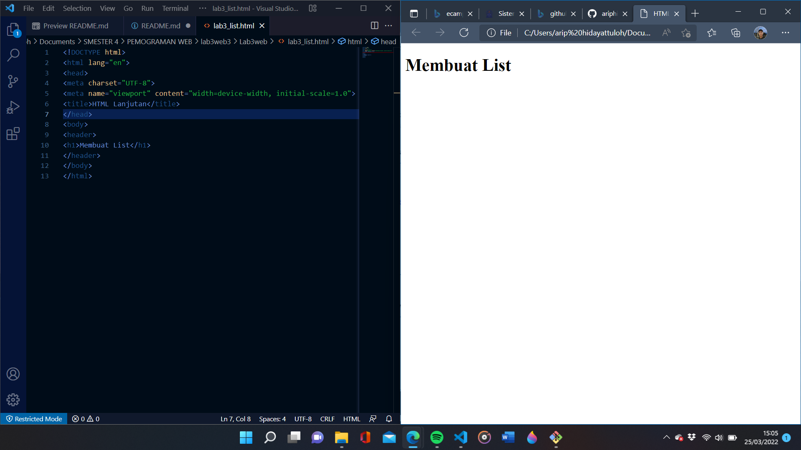 

Kemudian tambahkan kode untuk membuat Ordered List seperti berikut.

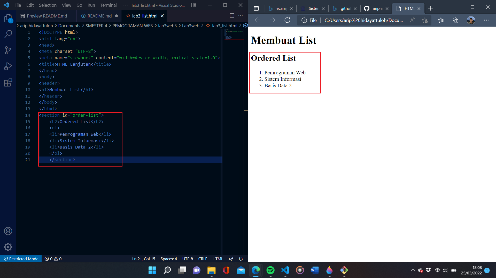 

Membuat Unorderd List
Kemudian tambakan kode untuk membuat Unordered List, setelah deklarasi ordered list pada
section unordered-list, seperti berikut.

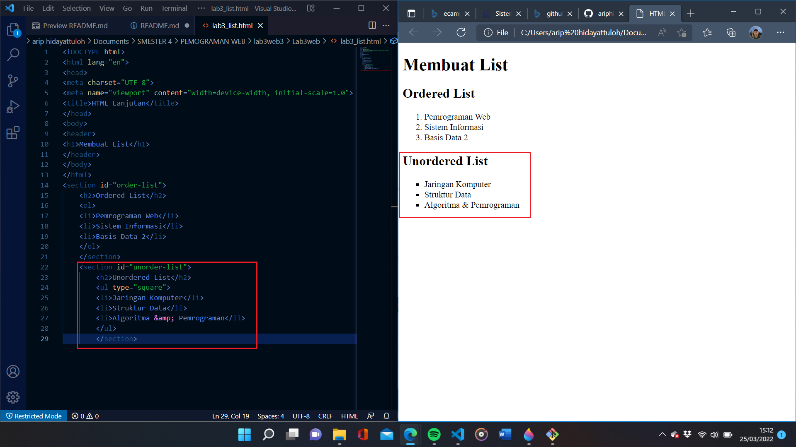 

Membuat Description List
Kemudian tambahkan kode untuk membuat description list setelah deklarasi unorderd-list.

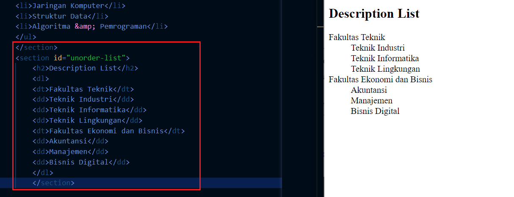 

Selanjutnya lakukan eksperimen lain terkait list dan penggunaan atribut type pada list.
Membuat Tabel
Buat file baru dengan nama `lab3_tabel.html`seperti berikut.

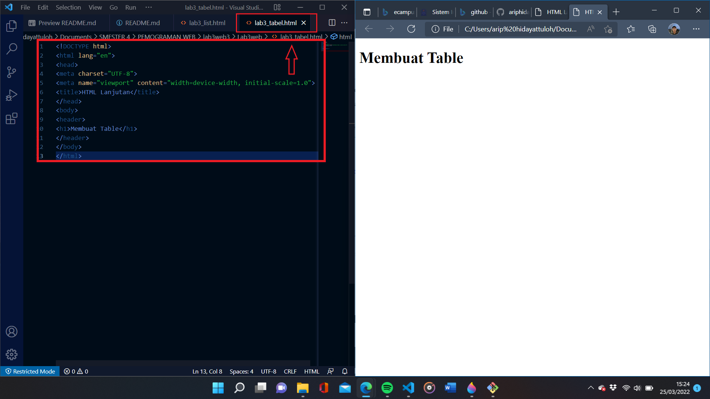 

Kemudian selanjutnya tambahkan kode untuk membuat tabel sederhana seperti berikut:

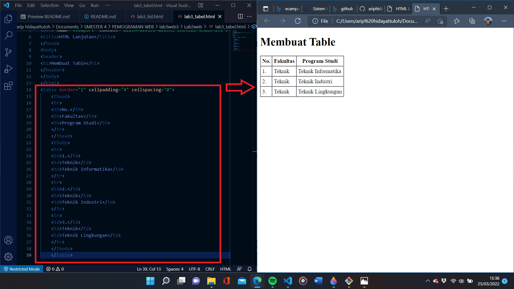 

Mengatur Margin dan Padding
Untuk mengatur margin dan padding pada cel data, tambahkan atribut cellpadding dan
cellspacing pada tag table.

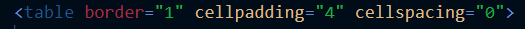 

Menggabungkan Sel Data
Untuk menggabungkan sel data, gunakan atribut rowspan dan colspan. Atribut rowspan untuk
menggabungkan baris (secara vertikal) dan colspan untuk menggabungkan kolom (secara
horizontal).

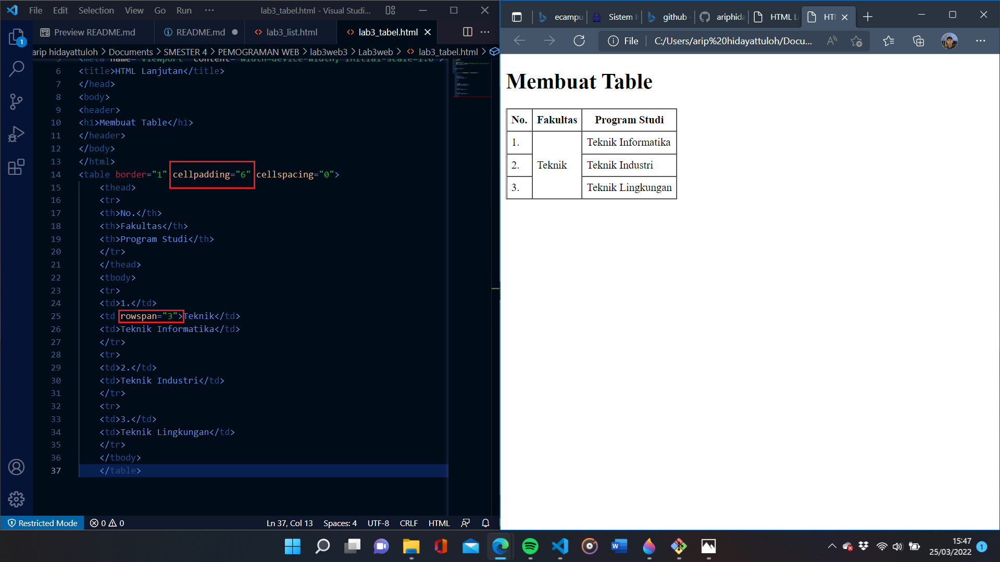 

Membuat Form
Buat file baru dengan nama `lab3_form.html` seperti berikut.

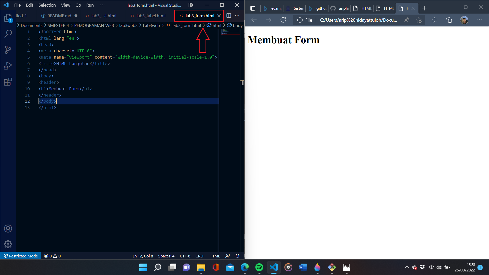 

Kemudian selanjutnya tambahkan kode untuk membuat tabel sederhana seperti berikut:

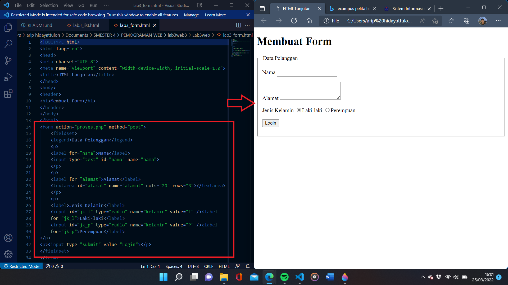 

Menabahkan Style pada Form
Agar tampilan form lebih menarik, bisa ditambahkan CSS seperti berikut.
akan terlihat perubahannya pada logo LOGIN
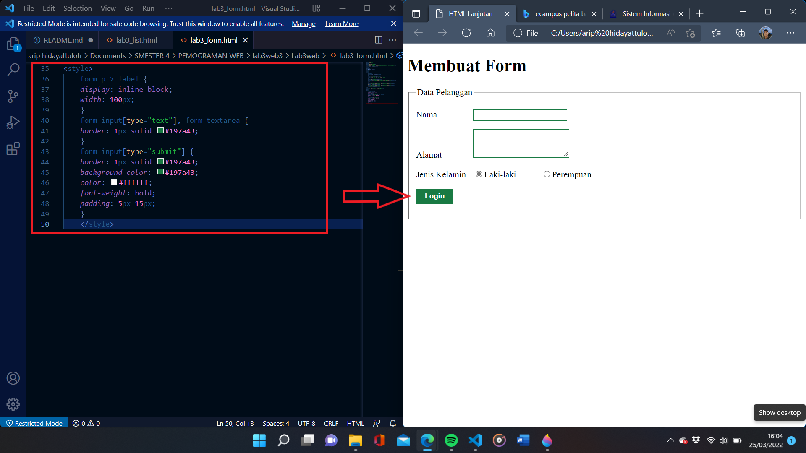 

## Pertanyaan dan Tugas

1. Buatlah form yang menampilkan dropdown menu dan listbox dengan multiple selection.